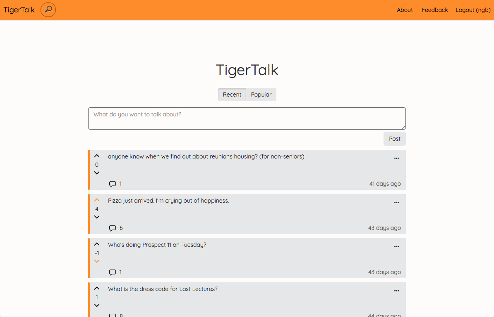
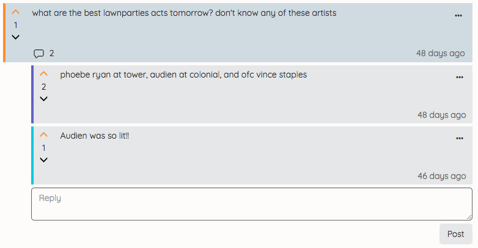
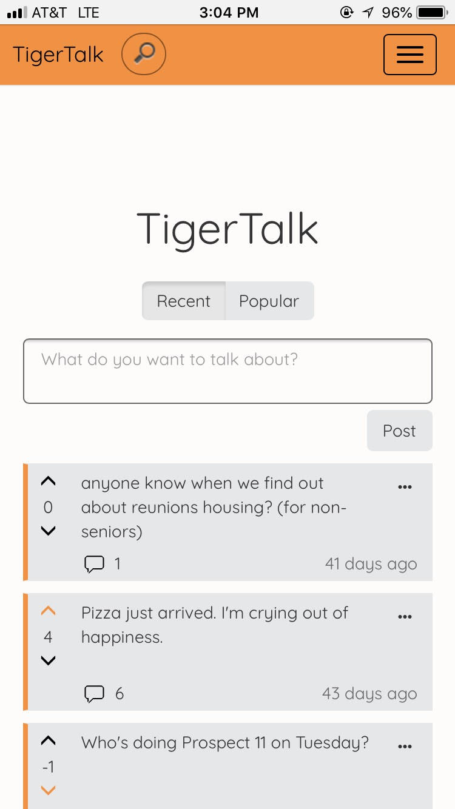

# TigerTalk

TigerTalk is a semi-anonymous conversation and Q&A web-app, developed as the final project for COS 333: Advanced Programming Techniques taught by Brian Kernighan in Spring 2018.

Features include:
* Princeton CAS authentication
* Anonymous posts and comments
* Randomized colors for comment authors 
* Upvoting and downvoting
* Sorting posts by 'recent' and 'popular'
* Search functionality
* Sharing individual posts by URL
* Reporting posts and comments to admins

## Images
### Comment thread

### Search results

### Mobile responsive design
		

## Stack

TigerTalk is built on Django and the [Django REST Framework](http://www.django-rest-framework.org/), with a PostgreSQL database. The front-end is built with [React](https://reactjs.org/) and [React-Bootstrap](https://react-bootstrap.github.io/), which are compiled and bundled into a Django template using [Babel](https://babeljs.io/) and [Webpack](https://webpack.js.org/). Authentication is handled by [Princeton's CAS server](https://csguide.cs.princeton.edu/publishing/cas) and [django-cas-ng](https://github.com/mingchen/django-cas-ng). TigerTalk is deployed using Heroku, although a public version of the site is currently unavailable.

## Installing and running the server

TigerTalk uses npm to manage JavaScript dependencies and [pipenv](https://docs.pipenv.org/) to manage Python dependencies, so these must already be installed.

To install and enter the virtual environment:

	pipenv install django
	pipenv shell

Any changes to the ReactJS components must be bundled before being available to Django. Run the following command from the root directory:

	node_modules/.bin/webpack --config webpack.config.js

To run the server locally, using a local database configuration in `settings.py`:

	python manage.py runserver

To run the server locally, using environmental variables in a .env file:

	honcho start

In case of the error 'ModuleNotFoundError: No module named 'webpack_loader', install django-webpack-loader via pip intead of pipenv, and restart the server.

Any changes to the data models must be migrated before becoming visible. Run the following commands, prefixed by "honcho run" if using honcho:

	python manage.py makemigrations
	python manage.py migrate

